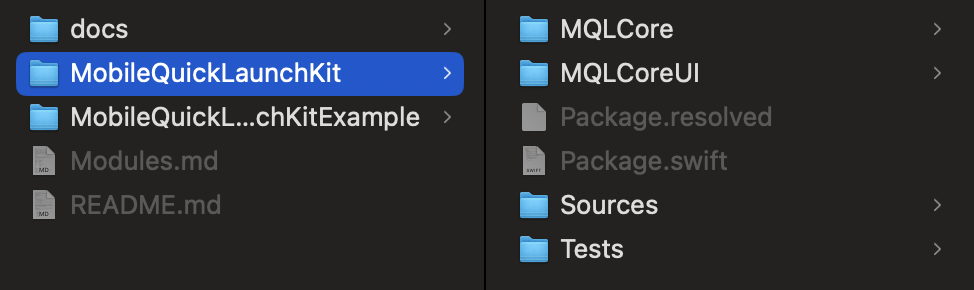
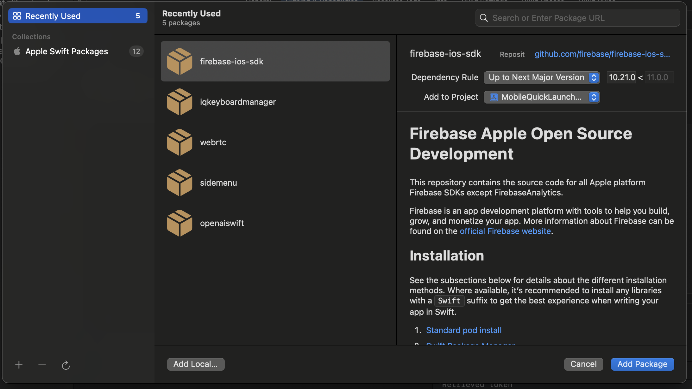
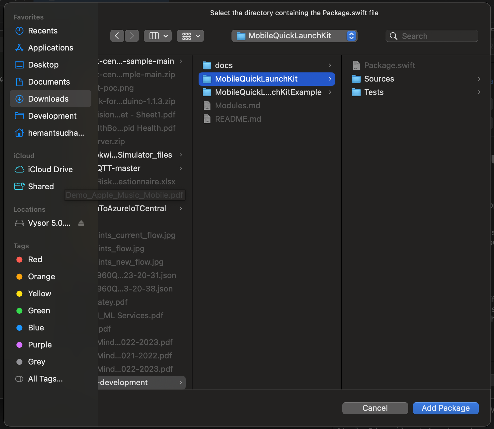
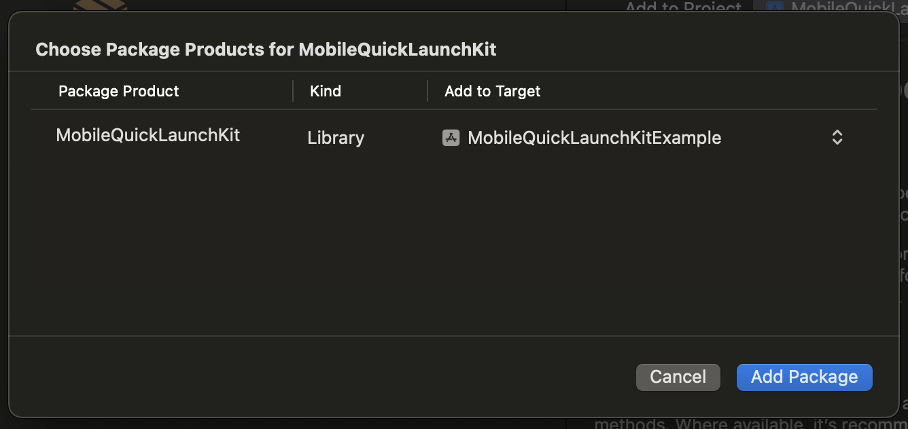
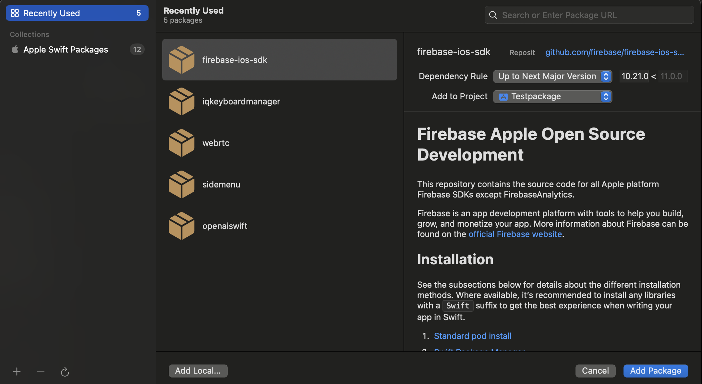
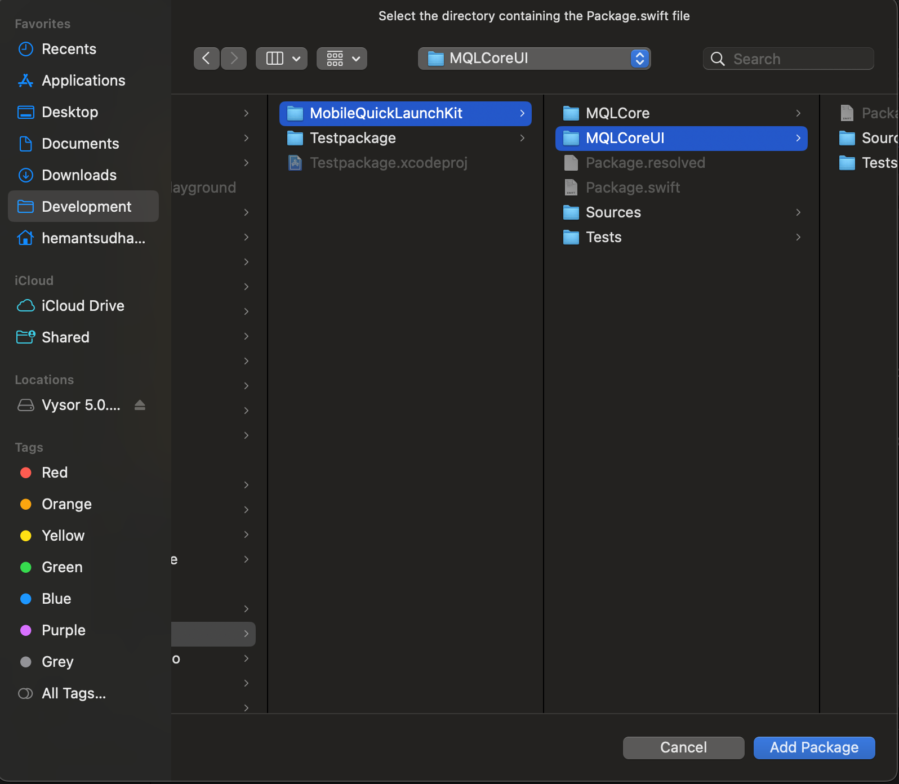
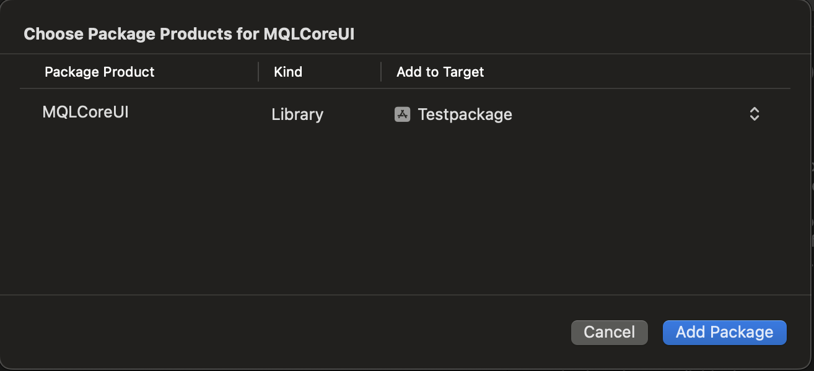

# MobileQuickLaunchKit Documentation

## Overview
Introducing MobileQuickLaunchKit, a powerful SwiftUI package designed to elevate your app development experience by seamlessly integrating essential features. It has dependencies with on separate packages: MQLCore and MQLCoreUI. With a focus on enhancing user engagement and customization, MobileQuickLaunchKit offers a robust set of functionalities, including a set of modules.

## Table of contents

1. [Modules](./Modules.md)
2. [Prerequisites](#prerequisites)
3. [Installation](#installation)
4. [Usage](#usage)
5. [Mockoon Setup Instructions](./docs/mockoon_setup.md)
6. [API Setup](./docs/apis_setup.md)

# Prerequisites
There are certain requirements to be followed in order to use it:
- Xcode >= 15.0
- SwiftUI
- iOS >= 14.0

# Installation 
As it contains three separate packages MobileQuickLaunchKit, MQLCore and MQLCoreUI. Here MQLCore and MQLCoreUI are the independent packages but the package MobileQuickLaunchKit has dependency on these two independent packages. You can go through the [modules](./Modules.md) section for the detailed documentation and decide which package fits into your requirement.
You can find these two independent packages: MQLCore and MQLCoreUI inside the MobileQuickLaunchKit folder

 ## 1. Adding The MobileQuickLaunchKit Package in your Project
 * Download the code as zip and extract it.
 * Find the package MobileQuickLaunchKit folder inside the extracted folder.

 * Copy the MobileQuickLaunchKit folder inside your project's root folder.
 * Click on File menu of the Xcode and select "Add Package Dependencies".
 
     
     
 * On add package window, click on "Add Local", navigate to downoaded project folder and select MobileQuickLaunchKit folder as a package and then click on "Add Package".
     
     
     
 * Wait for the package to load dependencies, once it loads all the dependencies, again click on "Add Package". Now the package has been added to your project.
      
      
      
 * Go to build phases, Add MobileQuickLaunchKit in Link Binary With Libraries section. You can ignore this step if it is already added.
 * Register your App on Firbase console, download GoogleService-Info.plist file and add to your project target.
 * Open your project configuration: click the project name in the left tree view. Select your app from the TARGETS section, then select the Info tab, and expand the URL Types section.
* Click the + button, and add a URL scheme for your reversed client ID. To find this value, open the GoogleService-Info.plist configuration file, and look for the REVERSED_CLIENT_ID key. Copy the value of that key, and paste it into the URL Schemes box on the configuration page. Leave the other fields untouched.
 * Now you can expand the package and access the files inside the package.

 ## 2. Adding The MQLCore or MQLCoreUI Package in your Project
 * Download the code as zip and extract it.
 * Find the package the MQLCore or MQLCoreUI  MobileQuickLaunchKit folder inside the extracted folder.

 * Copy the MQLCore or MQLCoreUI folder, whichever you want to add, inside your project's root folder.
 * Click on File menu of the Xcode and select "Add Package Dependencies".
 
     
     
 * On add package window, click on "Add Local", navigate to downoaded project folder and select MQLCore or MQLCoreUI  folder as a package and then click on "Add Package".
     
     
     
 * Wait for the package to load dependencies, once it loads all the dependencies, again click on "Add Package". Now the package has been added to your project.
      
      

# Usage  

## 1. Branding your App with Logo
If you want to add your company logo into the views those are defined inside the package like: Splash Screen and Sign In screen. Add a company logo in your project's assest folder by naming it *"CompanyLogo"*. As the name is case sensitive so please add your company logo image into your asset folder with same name. It will automatically pick the image from your main project.

## 2. MQLSignInView
MQLSignInView is a ready-to-use View integrated with all authentication screens like: Login, Sign up, Forget Password etc. You can simply add this view into your App and use the following features: SignIn, Sign up, Forget Password. You can present this view on the top of any View you created. Usage example:

    import SwiftUI
    import MobileQuickLaunchKit
    
    struct  YourView: View {
        @State  var  isLoginModalPresented = !MQLAppState.shared.isUserLoggedIn()
        
        var body: some View {
            NavigationView {
                HomeView()
            }
            .fullScreenCover(isPresented: $isLoginModalPresented) {
                MQLSignInView(isModalPresented: $isLoginModalPresented)
            }
        }
    }
        

## 3. MQLSettingsView
MQLSettingsView is a ready-to-use View inbuilt authentication feature. This view contains following features: Edit Profile, Change Password, Privacy, Logout, Help, About Us. Usage example: 

    import SwiftUI
    import MobileQuickLaunchKit
    
    struct  YourView: View {
        @State  var  isLoginModalPresented = !MQLAppState.shared.isUserLoggedIn()
        
        var body: some View {
            NavigationView {
                MQLSettingsView(isLoginModalPresented: $isLoginModalPresented)
            }
        }
    }
 

## 4. Initializing the App with Package ContentView and Authentication
 Here is a guide to intialize your App with MQLContentView and use authentication in your App.
 * import MobileQuickLaunchKit and GoogleSignIn in you main App.swift file
 * Create a ThemeManager object to pass the current theme as an environment Object
 * Initialize you App class and set your MQLAppState values. 
 * Initialize MQLContentView by providing the main view of your App

        import SwiftUI
        import MobileQuickLaunchKit
        import MQLCoreUI

        @main
        struct MobileQuickLaunchKitExampleApp: App {
            @StateObject public var themes = ThemeManager() //Object of ThemeManager
            init() {
                //Set the local storage value to the MQLAppState
                MQLAppState.shared.setValues()
            }
            
            var body: some Scene {
                WindowGroup {
                    // Initializing MQLContentView by providing the main view of your App
                    MQLContentView(
                        mainView: MainView()
                    )
                        .environmentObject(themes.current) // This will help us to access the members of current theme
                }
            }
        }

* Here is an Example how to add Authentication to your App's MainView.swift:

        import SwiftUI
        import MobileQuickLaunchKit
        import MQLCoreUI

        struct  MainView: View {
            @EnvironmentObject  var  theme : Theme
            @State  private var  selectedTab = 0
            @State public var isLoginModalPresented = !MQLAppState.shared.isUserLoggedIn()

            var  body: some  View {
                NavigationView {
                    TabView(selection: $selectedTab) {
                        HomeView()
                            .tabItem {
                                Label("Home", systemImage: "house")
                            }
                            .tag(0)
                        // Defined inside the MobileQuickLaunchKit package
                        MQLSettingsView(isLoginModalPresented: $isLoginModalPresented)
                            .tabItem {
                                Label("Settings", systemImage: "gearshape")
                            }
                            .tag(1)
                        }
                        .accentColor(theme.colors.primary) // Setting the color fro theme
                        .onAppear {
                            UITabBar.appearance().backgroundColor = UIColor(theme.colors.backGroundPrimary)
                        }
                    }
                    .navigationBarBackButtonHidden()
                    .fullScreenCover(isPresented: $isLoginModalPresented) {
                        /// Defined inside the MobileQuickLaunchKit package
                        /// Used to Authenticate the user
                        MQLSignInView(isModalPresented: $isLoginModalPresented)
                    }
                }
            }

* Here is simply a text added in HomeView you can create your own.

        import SwiftUI
        import MobileQuickLaunchKit
        import MQLCoreUI

        struct  HomeView: View {
            // To get the current theme data
            @EnvironmentObject  var  theme : Theme

            var body: some View {
                ZStack {
                    // View Background
                    theme.colors.backGroundPrimary
                        .ignoresSafeArea()
                        
                    Text("Welcome")
                        .font(theme.typography.h2)
                        .foregroundColor(theme.colors.secondary)
                }
            }
        }

## 5. Configuring App BaseURL and Settings Link
Default baseURL is "http://localhost:3001/api/v1/" being used by the package. You can change this to your base URL at the time you initialize your app. For example:

        import SwiftUI
        import MobileQuickLaunchKit
        import MQLCore

        @main
        struct MobileQuickLaunchKitExampleApp: App {
            init() {
                //Set your base URL
                MQLConstants.baseURL = "YOUR_BASE_URL"
                
                //Set your Setting page webview url's
                SettingsLinks.privacy = "YOUR_PRIVACY_URL"
                SettingsLinks.aboutUs = "YOUR_ABOUT_US_URL"
                SettingsLinks.help = "YOUR_HELP_URL"
            }
            
            var body: some Scene {
                WindowGroup {
                    // Initializing MQLContentView by providing the main view of your App
                    MQLContentView(
                        mainView: MainView()
                    )
                }
            }
        }

## 6. MQLCore
To find the detailed usage documentation for the package click [here](./MobileQuickLaunchKit/MQLCore/README.md)

## 7.  MQLCoreUI
To find the detailed usage documentation for the package click [here](./MobileQuickLaunchKit/MQLCoreUI/README.md)

#
* The sample App contains both kind of navigation using Tabbar and using Side Menu. You can choose anyone. For more information about the navigation please explore our sample project.
* To unveil the full potential and seamless integration of the Package, please explore the MobileQuickLaunchKitExample project.

