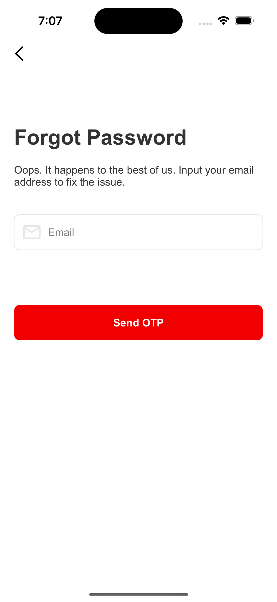
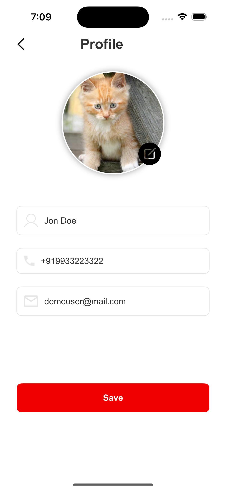
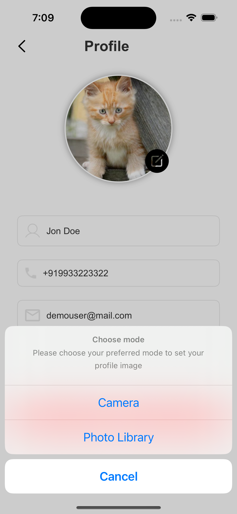

# Example Screens

## Authentication Screens

| Title                | Description                         |
| -------------------- | ----------------------------------- |
| **Sign-in**          | Log in to your account with ease.   |
| **Sign-up**          | Register for a new account quickly. |
| **Forgot Password**  | Easily recover your password.       |
| **OTP Verification** | Securely verify your identity.      |
| **Set New Password** | Create a new password securely.     |

<table>
  <tr>
    <td></td>
    <td></td>
    <td></td>
    <td></td>
    <td></td>
  </tr>
</table>

## Primary Screens

| Title                  | Description                                 |
| ---------------------- | ------------------------------------------- |
| **Drawer Menu**        | Navigate through app sections effortlessly. |
| **Settings**           | Personalize your app preferences.           |
| **Edit Profile**       | Update your user information.               |
| **Edit Profile Image** | Change your profile picture.                |
| **Change Password**    | Modify your account password.               |
| **Privacy**            | View our privacy policy.                    |

<table>
  <tr>
    <td></td>
    <td></td>
    <td></td>
    <td></td>
    <td></td>
    <td></td>
  </tr>
</table>
