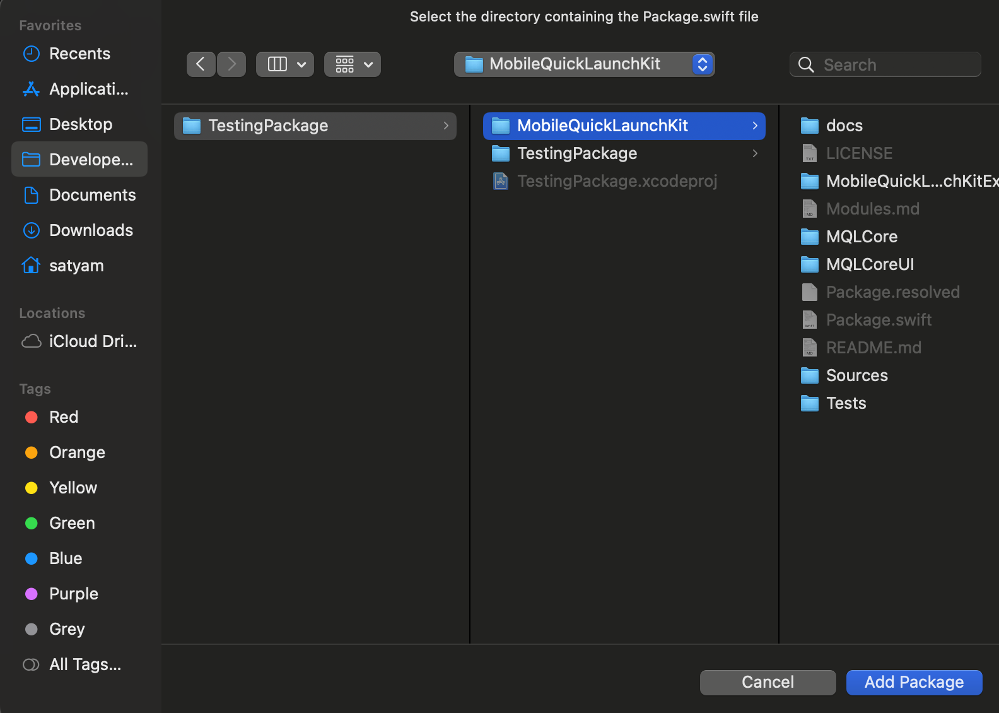
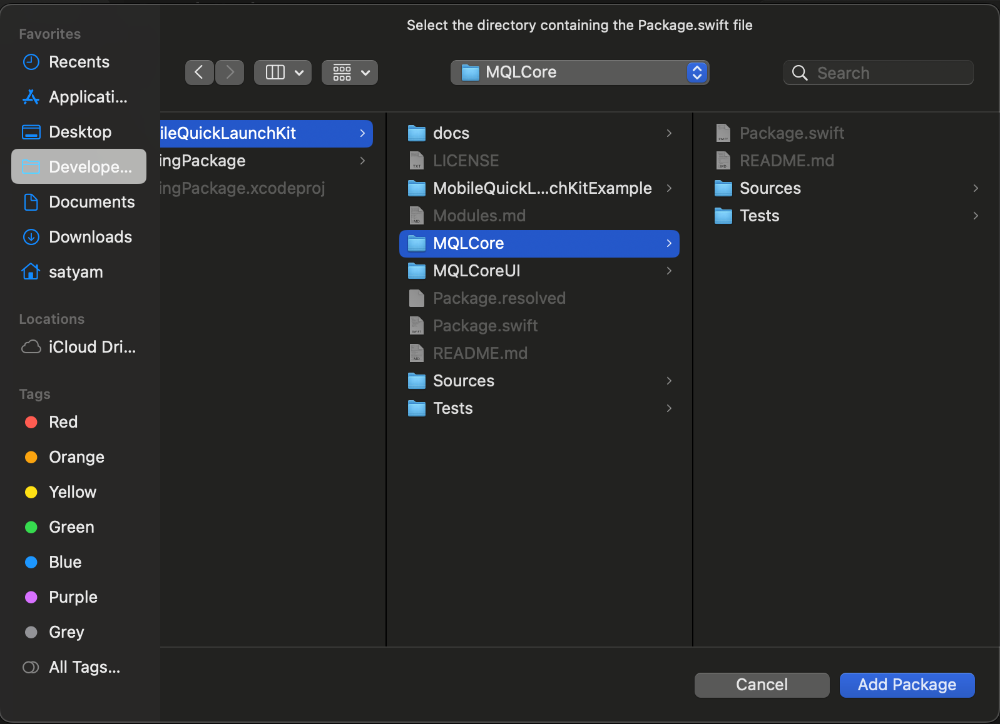
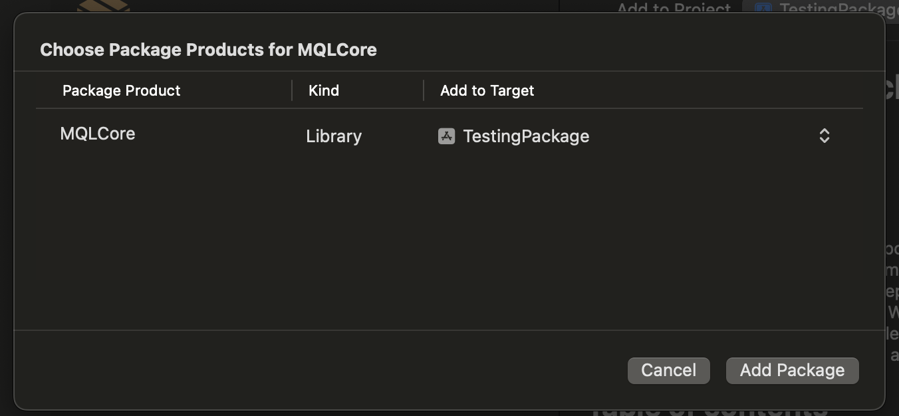

# Manual Installation

As it contains three separate packages MobileQuickLaunchKit, MQLCore and MQLCoreUI. Here MQLCore and MQLCoreUI are the independent packages but the package MobileQuickLaunchKit has dependency on these two independent packages. You can go through the [modules](../Modules.md) section for the detailed documentation and decide which package fits your requirements.

You can find these two independent packages: MQLCore and MQLCoreUI inside the MobileQuickLaunchKit folder

## 1. Adding The MobileQuickLaunchKit Package to your Project

* Download the code as zip and extract it.
* Copy the downloaded project inside your project's root folder.
* Click on File menu of the Xcode and select "Add Package Dependencies".


* On add package window, click on "Add Local", navigate to the project folder and select the downloaded project folder as a package and then click on "Add Package".



* Wait for the package to load dependencies, once it loads all the dependencies, again click on "Add Package". Now the package has been added to your project.


* Go to build phases, Add MobileQuickLaunchKit in Link Binary With Libraries section. You can ignore this step if it is already added.
* Register your App on the Firebase console, download GoogleService-Info.plist file and add it to your project target.
* Open your project configuration: click the project name in the left tree view. Select your app from the TARGETS section, then select the Info tab, and expand the URL Types section.
* Click the + button, and add a URL scheme for your reversed client ID. To find this value, open the GoogleService-Info.plist configuration file, and look for the REVERSED_CLIENT_ID key. Copy the value of that key, and paste it into the URL Schemes box on the configuration page. Leave the other fields untouched.
* Now you can expand the package and access the files inside the package.

## 2. Adding The MQLCore or MQLCoreUI Package to your Project

* Download the code as zip and extract it.
* Find the package MQLCore or MQLCoreUI in the downloaded project inside the extracted folder.
* Copy the MQLCore or MQLCoreUI folder, whichever you want to add, inside your project's root folder.
* Add the below Package.swift file in the MQLCore or MQLCoreUI folder 

For MQLCore Package - 
```
// swift-tools-version: 5.9
// The swift-tools-version declares the minimum version of Swift required to build this package.

import PackageDescription

let package = Package(
    name: "MQLCore",
    defaultLocalization: "en",
    platforms: [.iOS(.v14)],
    products: [
        // Products define the executables and libraries a package produces, making them visible to other packages.
        .library(
            name: "MQLCore",
            targets: ["MQLCore"]),
    ],
    targets: [
        // Targets are the basic building blocks of a package, defining a module or a test suite.
        // Targets can depend on other targets in this package and products from dependencies.
        .target(
            name: "MQLCore"),
        .testTarget(
            name: "MQLCoreTests",
            dependencies: ["MQLCore"]),
    ]
)
```

For MQLCoreUI Package - 

```
// swift-tools-version: 5.9
// The swift-tools-version declares the minimum version of Swift required to build this package.

import PackageDescription

let package = Package(
    name: "MQLCoreUI",
    defaultLocalization: "en",
    platforms: [.iOS(.v14)],
    products: [
        // Products define the executables and libraries a package produces, making them visible to other packages.
        .library(
            name: "MQLCoreUI",
            targets: ["MQLCoreUI"]),
    ],
    targets: [
        // Targets are the basic building blocks of a package, defining a module or a test suite.
        // Targets can depend on other targets in this package and products from dependencies.
        .target(
            name: "MQLCoreUI"),
        .testTarget(
            name: "MQLCoreUITests",
            dependencies: ["MQLCoreUI"]),
    ]
)
```


* Click on File menu of the Xcode and select "Add Package Dependencies".


* On add package window, click on "Add Local", navigate to the project folder and select the MQLCore or MQLCoreUI folder as a package and then click on "Add Package".



* Wait for the package to load dependencies, once it loads all the dependencies, again click on "Add Package". Now the package has been added to your project.


